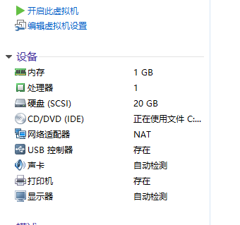

# **云计算原理与实践**

实验一

(1) 安装Git

(2) 创建SSH Key

\1. 新建ssh秘钥

​     ssh-keygen -t rsa -b 4096 -C [“953484059@qq.com”](mailto:\“953484059@qq.com\”)

\2. 复制“id_rsa.pub”的内容到GitHub网站的Settings–>SSH and GPG keys中

\3. 测试ssh key是否配置成功

 

(3) 创建一个项目

\1. 回到GitHub上面，点击“New Repository”创建项目

 

2.使用git在本地创建相同的项目并且远程连接GitHub项目

3.查看GitHub上面的cloudcomputing项目

(4) 购买腾讯云服务器 

(5) 使用web shell登录

 

(6) 下载安装xshell，并使用xshell登录腾讯云

 1.下载安装xshell 

\2. 建立密钥

\3. 绑定云服务器

 

\4. 进入xshell登录

 

 其实放的是公钥

\5. 连接成功

 

(7) 本地安装VMware Workstation和centos 操作系统

​    

​    