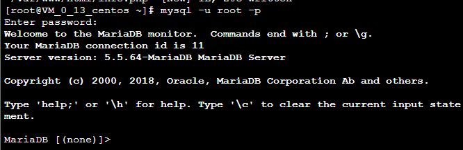

### 实验二:WordPress的安装与配置

####           1.安装Apache Web服务器

​             (1)使用yum工具安装:

​            

​             (2)安装完成之后，启动Apache Web服务器：    

​                  

​              (3)测试Apache服务器是否成功运行，找到腾讯云实例的公有IP地址(your_cvm_ip)，在你本地主机的浏 览器上输入：http://49.235.191.199

​              

####            2.安装MySQL

​              (1)安装MariaDB：

​              (2)安装好之后，启动mariadb：

​                  随后，运行简单的安全脚本以移除潜在的安全风险，启动交互脚本:

​              

​              (3)设置相应的root访问密码以及相关的设置(都选择Y)。

​                   最后设置开机启动MariaDB：

​                                      

####             3.安装PHP

​               (1)PHP 7.x包在许多仓库中都包含，这里我们使用Remi仓库，而Remi仓库依赖于EPEL仓库          

​               

​                

​                 (2)安装PHP以及php-mysql

​               

​                 (3)查看安装的php版本：

​              

​                (4)安装之后，重启Apache服务器以支持PHP：

​              

####              4.安装PHP模块

​                (1)这里先行安装php-fpm(PHP FastCGI Process Manager)和php-gd(A module for PHP applications for using the gd graphics library)，WordPress使用php-gd进行图片的缩放

​               

​                (2)重启Apache服务：

​              

​               这里我们利用一个简单的信息显示页面（info.php）测试PHP。创建info.php并将其置于Web服务的根目       

​               录(/var/www/html/)

​               sudo vim /var/www/html/info.php

​               该命令使用vim在/var/www/html/处创建一个空白文件info.php，我们添加如下内容：

​               <?php phpinfo(); ?>

​               完成之后，使用刚才获取的cvm的IP地址，在你的本地主机的浏览器中输入:

​               http://your_cvm_ip/info.php

​              

####             5.为wordpress建立一个mysql数据库

​                (1)以root用户登录MySQL数据库：

​                (2) 为WordPress创建一个新的数据库：

​                (3) 接着为WordPress创建一个独立的MySQL用户：

​                (4)自定义用户和密码

​                (5)刷新mysql权限

​                (6)退出(exit)

​             

####            6.安装WordPress

​              (1)下载WordPress至当前用户的主目录：

​              (2) 解压后主目录产生一个WordPress文件夹，将内容同步Apache服务器的目录下，使得WordPres被

​              访问

​              (3)接着在Apache服务器目录下为wordpress创建一个文件夹来保存上传的文件

​              (4)对Apache服务器的目录以及wordpress相关文件夹设置访问权限：

​             

​             

​             

​             

​             

####             7.配置WordPress

​               (1)通过nano来编辑数据库配置

​                   nano wp-config.php

​              

####             8.通过Web界面进一步配置WordPress 

​               配置成功