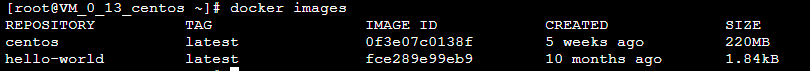

## **CentOS7 安装Docker**

### 1.安装Docker

##### 1.1查看操作系统内核信息

##### **1.2更新应用程序数据库**

##### **1.3启动Docker服务**

##### **1.4验证Docker是否成功**

### **2.Docker的基本操作**

##### **2.1拉取官方版本镜像和基于拉取好的镜像运行容器**

##### **2.2查看系统中存在的镜像**

### **3.运行Docker镜像**

##### **3.1安装Wordpress**

###### **3.1.1.安装Apache Web服务器**

(1) sudo yum install httpd

(2)sudo systemctl start httpd.service

###### **3.1.2安装Mysql**

(1)sudo yum install mariadb-server mariadb

(2)sudo systemctl start mariadb

(3)sudo mysql_secure_installation

(4)sudo systemctl enable mariadb.service*

###### **3.1.3安装PHP**

(1)sudo yum install epel-release yum-utils
    sudo yum install http://rpms.remirepo.net/enterprise/remi-release-7.rpm

​    sudo yum-config-manager --enable remi-php72

(2)sudo yum install php php-mysql

(3)sudo systemctl restart httpd.service

(4)sudo yum install php-fpm php-gd

(5)sudo service httpd restart

###### **3.1.4配置**

(1)mysql -u root -p

(2)CREATE DATABASE wordpress;

(3)CREATE USER wordpressuser@localhost IDENTIFIED BY 'password';

​    GRANT ALL PRIVILEGES ON wordpress.* TO wordpressuser@localhost IDENTIFIED BY 'password';

​    FLUSH PRIVILEGES;

##### **3.2查看本地中的容器docker ps**

##### **3.3运行Docker镜像**

##### **3.4注册Docker并登录**

##### **3.5将容器wordpress保存为新的镜像,并添加提交人信息和说明信息。**

##### **3.6在webshell上登录Docker**

##### **3.7推送新创建的镜像**

