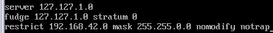

# **Ceph多节点集群部署**

## 1.Ceph基于4个节点的安装

1.1创建4台装有CentOS 7的虚拟机

 

1.2修改主机名字

 

1.3Reboot

1.4修改IP与主机名的对应关系(4个节点都要)

 

IP地址通过IP addr查看

1.5重启网络服务且创建新用户

 

1.6Ceph各节点的新用户都有免密码sudo权限

 

 

1.7安装并配置NTP服务

sudo yum install ntp ntpdate ntp-doc

 

 

 

1.8Ceph-admin节点

注释掉这四行(/etc/ntp.conf)

 

添加这三行

 

ceph-0/1/2节点

 

 

证明各个节点连接成功

 

1.9安装ssh

 

 

ssh-copy-id ceph-deploy@ceph-0
ssh-copy-id ceph-deploy@ceph-1
ssh-copy-id ceph-deploy@ceph-2

修改~/.ssh/config，这样 ceph-deploy 就能用新用户名登录各个 Ceph 节点

 

~/.ssh/config（一般默认没有要自己创建文件）

chmod 644 ~/.ssh/config

2.0关闭selinux&firewalld

 

 

其它节点也要关

 

## **2.安装Ceph部署工具**

2.1(ceph-admin节点)sudo yum install -y yum-utils && sudo yum-config-manager --add-repo https://dl.fedoraproject.org/pub/epel/7/x86_64/ && sudo yum install --nogpgcheck -y epel-release && sudo rpm --import /etc/pki/rpm-gpg/RPM-GPG-KEY-EPEL-7 && sudo rm /etc/yum.repos.d/dl.fedoraproject.org*

 

 

2.2将软件包源加入软件仓库

sudo vim /etc/yum.repos.d/ceph.repo

2.3将ceph.repo拷贝到其余三个节点ceph-0/1/2

 

2.4sudo yum makecache(刷新源缓存)

2.5sudo yum update && sudo yum install ceph-deploy(更新软件库并安装 ceph-deploy)

2.6在ceph-admin节点上创建一个目录，用于保存 ceph-deploy 生成的配置文件和密钥对

创建集群

 

2.7修改ceph.conf

 

2.8在所有节点手动安装Ceph(每个节点都要)

sudo yum install ceph ceph-radosgw

每个节点都要上述2.1步骤，不然安装过程中就会出现这个错误

 

 

2.9初始化monitor(s)

 

3.0准备并激活OSD

 

 

3.1对 ceph.client.admin.keyring 有正确的操作权限

 

 

3.2检查集群的健康状况

 

 

## **3.** **遇到的错误**

[Linux安装命令出现如下错误：cannot find a valid baseurl for repo :base/7x86_64](https://www.cnblogs.com/PatrickLiu/p/8433273.html)

 **vi /etc/sysconfig/network-scripts/ifcfg-ens33**

修改以下内容

   **ONBOOT=yes**   最重要修改项

​    BOOTPROTO=dhcp  

​    DNS1=192.168.127.2  

 